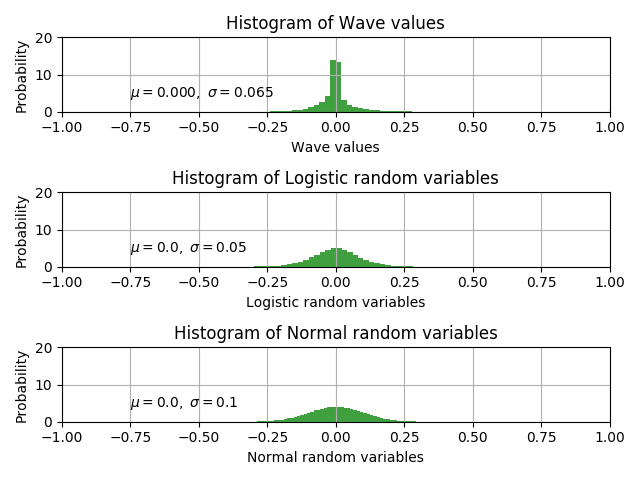
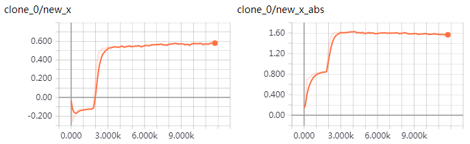
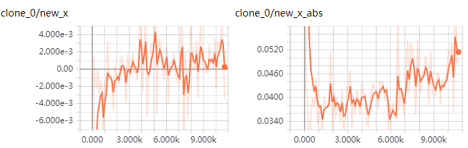
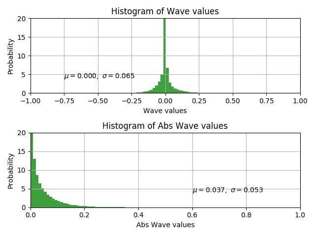

Implement parallel wavenet based on nsynth.

To make the code and configuration as simple as possible, most of the extensible properties are not extended and are set to default values.

Librosa downsample result may be not in [-1, 1), so use tool/sox_downsample.py to downsample all waves first.

* [OK] wavenet 
* [OK] fastgen for wavenet  
* [OK] parallel wavenet  
* [OK] gen for parallel wavenet

It seems that using mu law make the training easier. So experiment it first.  
The following examples are more of functional test than gaining good waves. The network may be not trained enough.
* tune wavenet 
    * [OK] use_mu_law + ce [LJ001-0001](tests/pred_data-use_mu_law+ce/gen_LJ001-0001.wav) [LJ001-0002](tests/pred_data-use_mu_law+ce/gen_LJ001-0002.wav)
    * [OK] use_mu_law + mol [LJ001-0001](tests/pred_data-use_mu_law+mol/gen_LJ001-0001.wav) [J001-0002](tests/pred_data-use_mu_law+mol/gen_LJ001-0002.wav)
    * [OK] no_mu_law + mol [LJ001-0001](tests/pred_data-no_mu_law+mol/gen_LJ001-0001.wav) [LJ001-0002](tests/pred_data-no_mu_law+mol/gen_LJ001-0002.wav)
* tune parallel wavenet 
    * use_mu_law
    * no_mu_law [Failed case 1](tests/pred_data-pwn-failed_cases/gen_LJ001-0001-stft_mag.wav) [Failed case 2](tests/pred_data-pwn-failed_cases/gen_LJ001-0001-stft_log.wav)
    
The power loss defination is important, the failed case 1 use `pow(abs(stft(y)))` as mean square error input, 
the failed case2 use `log(abs(stft(y)))`. The are both noisy, but the noises is of different type. I an still working on this.

Proper initial mean_tot and scale_tot values have positive impact on model convergence and numerical stability.
According to the LJSpeech data distribution, proper initial values for mean_tot  and scale_tot should be 0.0 and 0.05.
I modified the initializer to achieve it.  
   
The figure is pot by [this script](tests/test_wave_distribution.py)

Decreasing loss does not indicate that everything goes well.
I found a straightforward method to determine whether a parallel wavenet is running OK. 
Compare the values of `new_x, new_x_std, new_x_abs, new_x_abs_std` listed in tensorboard to statistics of real data.
If there is no difference of many orders of magnitudes, the training process is moving in the right direction.   

e.g. The first tensorboard figure comes from a parallel wavenet trained without power lowss.
The values of `new_x, new_x_abs` are too large compared to real data. So I cannot get meaningful waves from this model.
The second is a model using power loss. Its values are much closer to real data. 
And it is generating very noisy but to some extent meaningful waves.

      
      
   
